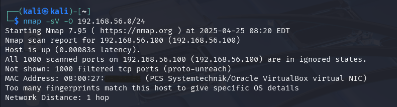
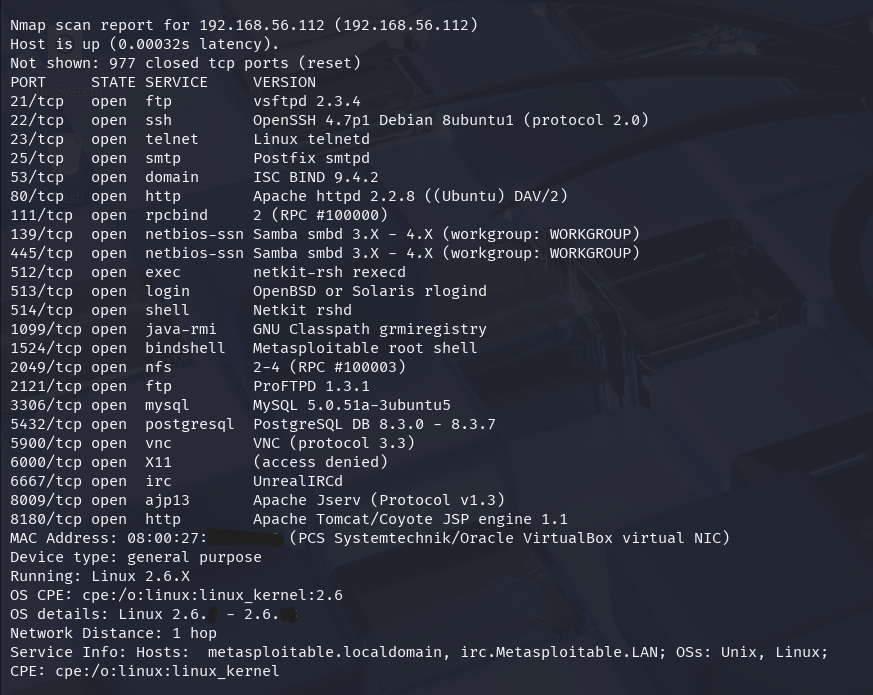
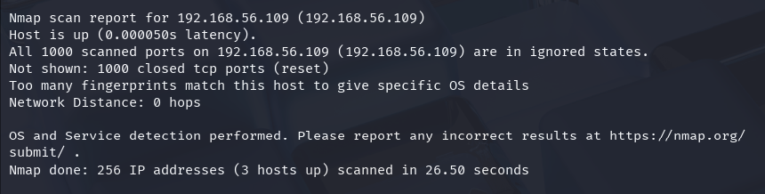

# Network Scanning Lab
Identify Potential Security Gaps

## Objective

Scanned the lab's internal network using Nmap to identify active devices, open ports, and running services, especially on Metasploitable2 (VM). The main objective was to understand the network structure and potential security holes in terms of open ports and service versions.

## Skills Learned

- Detecting active hosts on the lab's internal network
- Perform port scanning to identify open ports
- Detect open ports and services running on active hosts using the -sV option.

## Tools Used

- Nmap 7.95 (Kali-Linux VM CLI version)
- Ubuntu (VM)
- Metasploitable2 (VM)
- Oracle VirtualBox (Host-Only Network)
- Command Prompt

## Steps

1. Specify the internal network target: 192.168.56.0/24 (Host-Only Network)
2. Run the command: nmap -sV -O 192.168.56.0/24  
Explanation:  
• -sV: service version detection  
• -O: operating system detection

#### Results and Analysis

<i>Img 1: Ubuntu </i>  
  
The host is on, but all ports are closed or filtered, there may be an active firewall.
- IP Address: 192.168.56.100
- Status: Host is up (active)
- Ports: All ports are filtered or unreachable
- MAC Address detected: 08:00:27:XX:XX:XX
- Network Distance: 1 hop (local network)

<i>Img 2: Metasploitable2 </i>  
  
Active and many services show old and vulnerable versions in Metasploitable2, vulnerable to exploitation.
- IP Address: 192.168.56.112
- Status: Host is up (active)
- Ports: Many open and vulnerable ports
- MAC Address detected: 08:00:27:XX:XX:XX
- Operating System detected: Linux 2.6.x - 2.6.x
- Network Distance: 1 hop (local network)

<i>Img 3: Kali Linux </i>  
  
Host is alive, all ports are closed, no open services detected.
- IP Address: 192.168.56.109
- Status: Host is up (active)
- Ports: All ports are closed 
- Network Distance: 0 hops (local network)

Nmap completed. 3 hosts were active on the internal network and detected in 26.50 seconds.

## Conclusion

Network scanning using Nmap provides important information about active devices, open ports, and services. This information can be used as material for further identification, especially in services with old versions and look vulnerable to exploration or exploitation.
